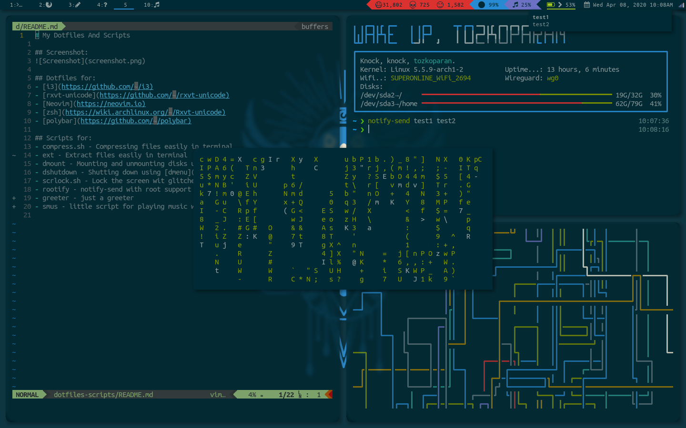

# My Dotfiles And Scripts

## Screenshot:

## Dotfiles for:
- [i3](https://github.com/i3/i3)
- [rxvt-unicode](https://github.com/exg/rxvt-unicode)
- [Neovim](https://neovim.io)
- [zsh](https://wiki.archlinux.org/index.php/Rxvt-unicode)
- [polybar](https://github.com/polybar/polybar)

## Scripts for:
- compress.sh - Compressing files easily in terminal
- ext - Extract files easily in terminal
- dmount - Mounting and unmounting disks using [dmenu](https://tools.suckless.org/dmenu/)
- dshutdown - Shutting down using [dmenu](https://tools.suckless.org/dmenu/)
- scrlock.sh - Lock the screen wit glitched background using [i3lock](https://github.com/i3/i3lock)
- rootify - notify-send with root support
- greeter - just a greeter
- smus - little script for playing music with mpv

